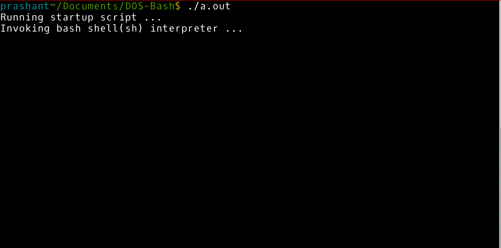

# DOS-Bash

This is a simple fun to use MS-DOS emulator that emulates the 
DOS command by implementing their linux alternatives on back
end. You'd get windows like feeling while using this.

This would run on all Unix/Linux systems. You can compile and
start using it or tweaking it according to you.

